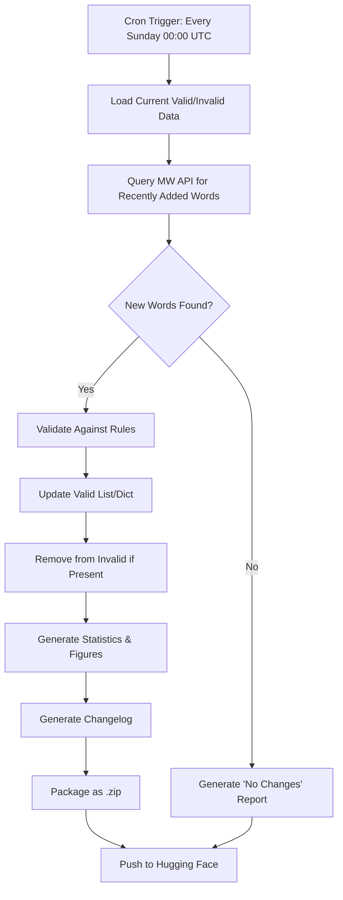

# Phase 3: Updating Pipeline Strategy Document
## English OpenList - Automated Dictionary Updates and Distribution Platform

**Created:** January 12, 2026  
**Author:** English OpenList Project Team  
**Status:** Planning Phase

---

## Table of Contents

1. [Executive Summary](#1-executive-summary)
2. [Goals and Requirements](#2-goals-and-requirements)
3. [System Architecture](#3-system-architecture)
4. [Dictionary API Selection](#4-dictionary-api-selection)
5. [Platform Selection](#5-platform-selection)
6. [Weekly Update Pipeline](#6-weekly-update-pipeline)
7. [Deliverables and File Structure](#7-deliverables-and-file-structure)
8. [Implementation Roadmap](#8-implementation-roadmap)
9. [Future Enhancements](#9-future-enhancements)

---

## 1. Executive Summary

Phase 3 represents the final stage of the English OpenList project, transforming our validated word corpus into a **living, continuously updated, freely downloadable resource**. 

### Background

Phases 1 and 2 successfully produced:
- **378,666 validated English words** (`merged_valid_words.txt` / `merged_valid_dict.json`)
- **9,275,414 invalidated entries** (`merged_invalid_words.txt` / `merged_invalid_dict.json`)
- **26 alphabetized subsets** for both valid and invalid data
- **Comprehensive reports** documenting methodology and results

Phase 3 will add:
- **Automatic weekly dictionary scraping** for new word discovery
- **A public distribution platform** (Hugging Face Datasets)
- **Version-controlled releases** with changelogs
- **Statistical reports and visualizations** for each update

---

## 2. Goals and Requirements

### 2.1 Primary Goals

| Goal | Description |
|------|-------------|
| **Mostly Current** | Weekly scraping of authoritative dictionary APIs to discover newly added words |
| **Freely Downloadable** | Public hosting on an established platform with .zip downloads |
| **Version-Controlled** | Historical archive of all weekly updates, organized by date |
| **Transparent** | Changelog/report generated for every update (even if no changes) |

### 2.2 Functional Requirements

#### Automated Updates
- [ ] Weekly scheduled scrape of dictionary API(s)
- [ ] Check if discovered words satisfy validation rules (lowercase, alphabetic only, no proper nouns)
- [ ] Add valid new words to Valid list/dictionary
- [ ] Remove entries from Invalid list/dictionary if they have been "promoted" to Valid
- [ ] Generate update report (even when no changes occur)

#### Validation Rules (Scrabble-Compatible)
Words are **valid** if they:
1. Contain only lowercase letters a-z
2. Are **not** proper nouns (unless commonly used as verbs, e.g., "google")
3. Are recognized by an authoritative English dictionary
4. Are not abbreviations, acronyms, or slang (unless lexicographically recognized)

#### Distribution
- [ ] Provide downloadable .zip files containing:
  - Updated `merged_valid_words.txt` and `merged_valid_dict.json`
  - Updated `merged_invalid_words.txt` and `merged_invalid_dict.json`
  - `CHANGELOG.md` for that update
  - Statistical CSVs and PNG visualizations
  - Statistical summary report (.md)
- [ ] Maintain historical archive of all previous weekly releases
- [ ] Organize releases by date (e.g., `releases/2026-01-19/`)

### 2.3 Non-Functional Requirements

| Requirement | Target |
|-------------|--------|
| **Automation** | Zero manual intervention for routine updates |
| **Reliability** | Graceful handling of API rate limits, downtime |
| **Cost** | Minimal/free (no paid API tiers if possible) |
| **Transparency** | All scripts and data publicly accessible |

---

## 3. System Architecture

### 3.1 High-Level Architecture

```
┌─────────────────────────────────────────────────────────────────────────┐
│                        GITHUB ACTIONS (WEEKLY CRON)                      │
│                                                                          │
│  ┌──────────────┐    ┌──────────────┐    ┌──────────────┐               │
│  │   1. SCRAPE  │───▶│  2. VALIDATE │───▶│  3. UPDATE   │               │
│  │  Dictionary  │    │  New Words   │    │  Lists/Dicts │               │
│  │     API      │    │   (Rules)    │    │              │               │
│  └──────────────┘    └──────────────┘    └──────────────┘               │
│         │                                       │                        │
│         ▼                                       ▼                        │
│  ┌──────────────┐                       ┌──────────────┐                │
│  │ 4. GENERATE  │                       │ 5. GENERATE  │                │
│  │  Statistics  │                       │   Changelog  │                │
│  │  + Figures   │                       │   + Report   │                │
│  └──────────────┘                       └──────────────┘                │
│         │                                       │                        │
│         └───────────────────┬───────────────────┘                        │
│                             ▼                                            │
│                    ┌──────────────┐                                      │
│                    │  6. PACKAGE  │                                      │
│                    │    (.zip)    │                                      │
│                    └──────────────┘                                      │
│                             │                                            │
└─────────────────────────────┼────────────────────────────────────────────┘
                              │
                              ▼
               ┌─────────────────────────────┐
               │    HUGGING FACE DATASETS    │
               │  (Public Dataset Repository)│
               │                             │
               │  ├── latest/                │
               │  │   └── valid.zip          │
               │  │   └── invalid.zip        │
               │  │   └── changelog.md       │
               │  │   └── stats/             │
               │  │                          │
               │  └── releases/              │
               │      └── 2026-01-12/        │
               │      └── 2026-01-19/        │
               │      └── ...                │
               └─────────────────────────────┘
```

### 3.2 Technology Stack

| Component | Technology | Reason |
|-----------|------------|--------|
| **Orchestration** | GitHub Actions | Free for public repos, native cron scheduling |
| **Language** | Python 3.12+ | Consistent with Phases 1-2 |
| **Dictionary API** | See Section 4 | Primary source for new words |
| **Hosting** | Hugging Face Datasets | Free, built for ML datasets, Git-based versioning |
| **Data Format** | JSON + TXT + Parquet | Human-readable + ML-optimized |

---

## 4. Dictionary API Selection

### 4.1 API Comparison

| API | Authority | Cost | Rate Limit | New Words | Proper Noun Filter |
|-----|-----------|------|------------|-----------|-------------------|
| **Merriam-Webster Collegiate** | ⭐⭐⭐⭐⭐ | Free (1000/day) | 1000/day | Yes | Via response parsing |
| **Free Dictionary API** | ⭐⭐⭐ | Free (Unlimited) | None | No | No |
| **Wordnik** | ⭐⭐⭐⭐ | Free (15k/day) | 15k/hour | Yes | Limited |
| **Oxford Dictionaries** | ⭐⭐⭐⭐⭐ | Paid | 3000/month (trial) | Yes | Yes |

### 4.2 Recommended: Merriam-Webster Collegiate Dictionary API

**Why Merriam-Webster?**
1. **Authority:** America's most trusted dictionary; widely used as Scrabble reference
2. **New Word Coverage:** Actively adds new words (e.g., "boba," "furikake" in recent updates)
3. **Free Tier:** 1000 requests/day is sufficient for weekly delta checks
4. **Rich Metadata:** Includes part of speech, etymology, pronunciation (useful for dictionary entries)
5. **Proper Noun Detection:** Response structure distinguishes entries (no `meta.id` for proper nouns)

**API Details:**
- **Base URL:** `https://www.dictionaryapi.com/api/v3/references/collegiate/json/{word}?key={api_key}`
- **Free Tier:** Requires registration at [dictionaryapi.com](https://www.dictionaryapi.com/)
- **Response:** JSON with `meta`, `hwi`, `fl` (part of speech), `def` fields

### 4.3 Proper Noun Filtering Strategy

Merriam-Webster entries for proper nouns typically:
1. Have `fl` (functional label) as `noun` with no generic definition
2. Are capitalized in `hwi.hw` (e.g., "Paris" vs "paris")
3. May have `meta.section: "biog"` (biographical) or `"geog"` (geographical)

**Implementation:**
```python
def is_proper_noun(entry: dict) -> bool:
    """Detect proper nouns in Merriam-Webster response."""
    # Check if headword is capitalized
    hw = entry.get("hwi", {}).get("hw", "")
    if hw and hw[0].isupper():
        return True
    # Check for biographical/geographical sections
    section = entry.get("meta", {}).get("section", "")
    if section in ("biog", "geog"):
        return True
    return False
```

### 4.4 Fallback: Free Dictionary API

For supplementary lookups or when rate limits are hit:
- **URL:** `https://api.dictionaryapi.dev/api/v2/entries/en/{word}`
- **Pros:** Unlimited, no API key needed
- **Cons:** Less authoritative, no new-word tracking

---

## 5. Platform Selection

### 5.1 Platform Comparison

| Platform | Free Tier | Versioning | Automation | Download Format | ML Integration |
|----------|-----------|------------|------------|-----------------|----------------|
| **Hugging Face Datasets** | ✅ Unlimited | ✅ Git-based | ✅ GitHub Actions | ✅ .zip, .parquet | ✅ Native |
| **Kaggle Datasets** | ✅ Unlimited | ❌ Manual | ❌ Limited | ✅ .zip | ⚠️ Limited |
| **GitHub Releases** | ✅ Unlimited | ✅ Tags | ✅ Native | ✅ .zip | ❌ None |
| **Custom Website** | ❌ Hosting Cost | ✅ Custom | ✅ Custom | ✅ Any | ❌ None |

### 5.2 Recommended: Hugging Face Datasets

**Why Hugging Face?**

1. **Free and Unlimited:** No storage or bandwidth limits for public datasets
2. **Git-Based Versioning:** Every commit creates a historical snapshot (perfect for weekly updates)
3. **Automation:** Easy integration with GitHub Actions via `huggingface_hub` library
4. **Data Studio:** Built-in web viewer for exploring data without download
5. **ML Ecosystem:** `datasets` library enables easy loading in Python/Jupyter
6. **Community:** Established platform with millions of users

**Dataset Structure:**
```
english-openlist/
├── README.md                    # Dataset card (documentation)
├── data/
│   ├── valid_words.txt          # Latest valid word list
│   ├── valid_dict.json          # Latest valid dictionary
│   ├── invalid_words.txt        # Latest invalid word list
│   └── invalid_dict.parquet     # Latest invalid dict (compressed)
├── releases/
│   ├── 2026-01-12/
│   │   ├── valid.zip
│   │   ├── invalid.zip
│   │   ├── CHANGELOG.md
│   │   └── stats/
│   │       ├── update_statistics.csv
│   │       ├── word_length_distribution.png
│   │       └── STATISTICAL_REPORT.md
│   └── 2026-01-19/
│       └── ...
└── CHANGELOG.md                  # Cumulative changelog
```

### 5.3 Alternative: GitHub Releases

If Hugging Face is not desired, we can use **GitHub Releases**:
- Each weekly update becomes a tagged release (e.g., `v2026.01.19`)
- .zip files attached as release assets
- Changelog in release notes
- GitHub Actions handles everything natively

---

## 6. Weekly Update Pipeline

### 6.1 Pipeline Steps



### 6.2 GitHub Actions Workflow

```yaml
# .github/workflows/weekly_update.yml
name: Weekly Dictionary Update

on:
  schedule:
    # Run every Sunday at 00:00 UTC
    - cron: '0 0 * * 0'
  workflow_dispatch:  # Allow manual trigger

jobs:
  update:
    runs-on: ubuntu-latest
    steps:
      - name: Checkout repository
        uses: actions/checkout@v4
        with:
          lfs: true

      - name: Set up Python
        uses: actions/setup-python@v5
        with:
          python-version: '3.12'

      - name: Install dependencies
        run: |
          pip install -r phase3/requirements.txt

      - name: Run update pipeline
        env:
          MW_API_KEY: ${{ secrets.MW_API_KEY }}
          HF_TOKEN: ${{ secrets.HF_TOKEN }}
        run: |
          python phase3/scripts/run_weekly_update.py

      - name: Push to Hugging Face
        env:
          HF_TOKEN: ${{ secrets.HF_TOKEN }}
        run: |
          python phase3/scripts/push_to_huggingface.py
```

### 6.3 New Word Discovery Strategy

**Challenge:** Merriam-Webster doesn't provide a "recently added words" API endpoint.

**Solutions:**

1. **RSS Feed Parsing:**
   - Merriam-Webster publishes new words at: https://www.merriam-webster.com/words-at-play
   - Scrape article titles for new word announcements

2. **Delta Comparison:**
   - Maintain a `known_words.txt` list of all previously checked words
   - Periodically query a word list source (e.g., SCOWL updates, Wiktionary dumps)
   - Compare against `known_words.txt` to find new candidates
   - Validate new candidates against MW API

3. **External New Word Lists:**
   - Subscribe to dictionary announcement feeds
   - Use Wordnik's "Word of the Day" API for exposure to new additions
   - Monitor linguistics blogs/news for neologism announcements

**Recommended Approach:** Hybrid of (1) and (2) — parse MW's news feed for announced words, then validate against the API.

---

## 7. Deliverables and File Structure

### 7.1 Weekly Release Contents

Each weekly release will include the following .zip files:

#### `english_openlist_valid_YYYY-MM-DD.zip`
```
valid/
├── merged_valid_words.txt          # All valid words (one per line)
├── merged_valid_dict.json          # Full metadata dictionary
├── alphabetized/                   # 26 letter-based subsets
│   ├── valid_a.txt
│   ├── valid_a_dict.json
│   ├── valid_b.txt
│   └── ...
└── README.md                       # Valid list documentation
```

#### `english_openlist_invalid_YYYY-MM-DD.zip`
```
invalid/
├── merged_invalid_words.txt        # All invalid words
├── merged_invalid_dict.parquet     # Compressed metadata (Parquet for size)
└── README.md                       # Invalid list documentation
```

#### `english_openlist_changelog_YYYY-MM-DD.zip`
```
changelog/
├── CHANGELOG.md                    # This week's changes
├── CUMULATIVE_CHANGELOG.md         # All changes since project start
└── update_metadata.json            # Machine-readable update info
```

#### `english_openlist_statistics_YYYY-MM-DD.zip`
```
statistics/
├── update_statistics.csv           # Stats for this update
├── cumulative_statistics.csv       # Running totals
├── figures/
│   ├── word_length_distribution.png
│   ├── words_added_over_time.png
│   ├── part_of_speech_breakdown.png
│   └── ...
└── STATISTICAL_REPORT.md           # Summary of methods and results
```

### 7.2 Statistics to Track

| Statistic | Description |
|-----------|-------------|
| `total_valid_words` | Current size of valid list |
| `total_invalid_words` | Current size of invalid list |
| `words_added_this_week` | New words added to valid |
| `words_removed_from_invalid` | Words promoted from invalid to valid |
| `update_date` | ISO timestamp of this update |
| `data_sources_checked` | APIs/sources queried |
| `word_length_distribution` | Histogram data |
| `part_of_speech_distribution` | Noun/verb/adj/etc counts |

### 7.3 Changelog Format

```markdown
# English OpenList Changelog

## [2026-01-19] - Weekly Update

### Summary
- **Words Added:** 12
- **Words Promoted (Invalid → Valid):** 3
- **Data Sources:** Merriam-Webster Collegiate API

### New Words Added
| Word | Part of Speech | Source | Date Added to Dictionary |
|------|----------------|--------|--------------------------|
| boba | noun | MW | 2025-12 |
| furikake | noun | MW | 2025-11 |
| ... | ... | ... | ... |

### Words Promoted from Invalid to Valid
| Word | Reason |
|------|--------|
| vibe | Now recognized as verb ("to vibe") |
| ... | ... |

### Technical Notes
- Update completed at: 2026-01-19T00:15:32Z
- Duration: 45 seconds
- API calls made: 127
- No errors encountered
```

---

## 8. Implementation Roadmap

### 8.1 Phase 3 Milestones

| Week | Milestone | Deliverables |
|------|-----------|--------------|
| **Week 1** | API Setup & Testing | MW API key, test scripts, proper noun detection |
| **Week 2** | Core Update Pipeline | `run_weekly_update.py`, update logic |
| **Week 3** | Statistics & Visualization | Stats generation, matplotlib figures |
| **Week 4** | Hugging Face Integration | Dataset repo, `push_to_huggingface.py` |
| **Week 5** | GitHub Actions Setup | `.github/workflows/weekly_update.yml` |
| **Week 6** | Testing & Documentation | End-to-end testing, README updates |
| **Week 7** | Launch | First automated weekly update goes live |

### 8.2 File/Folder Structure for Phase 3

```
phase3/
├── PHASE3_STRATEGY.md              # This document
├── requirements.txt                # Python dependencies
├── config.py                       # API keys, settings
├── initial_deliverables/           # Input data from Phases 1-2
│   ├── merged_valid_words.txt
│   ├── merged_valid_dict.json
│   ├── merged_invalid_words.txt
│   ├── merged_invalid_dict.json
│   └── alphabetized_data/
├── scripts/
│   ├── run_weekly_update.py        # Main orchestration script
│   ├── dictionary_api.py           # MW API wrapper
│   ├── word_validator.py           # Rule-based validation
│   ├── data_updater.py             # List/dict update logic
│   ├── statistics_generator.py     # Stats and figures
│   ├── changelog_generator.py      # Changelog creation
│   ├── packager.py                 # .zip creation
│   └── push_to_huggingface.py      # HF upload script
├── templates/
│   ├── CHANGELOG_TEMPLATE.md
│   ├── STATISTICAL_REPORT_TEMPLATE.md
│   └── dataset_card.md             # HF README template
├── tests/
│   ├── test_dictionary_api.py
│   ├── test_word_validator.py
│   └── test_data_updater.py
└── output/                         # Generated releases (local)
    └── 2026-01-19/
        ├── valid.zip
        ├── invalid.zip
        ├── changelog.zip
        └── statistics.zip
```

---

## 9. Future Enhancements

### 9.1 Potential Additions

| Enhancement | Description | Priority |
|-------------|-------------|----------|
| **Multi-Source Aggregation** | Query multiple APIs (MW + Wordnik + Free Dict) | Medium |
| **User Submissions** | Allow community to suggest new words | Low |
| **Regional Variants** | Separate UK/US English lists | Low |
| **Pronunciation Data** | Include IPA/audio from MW | Medium |
| **Frequency Scores** | Add Google Ngram frequency data | Medium |
| **Email Notifications** | Weekly update email to subscribers | Low |
| **API Endpoint** | Provide a REST API to query the word list | High |

### 9.2 Potential Challenges

| Challenge | Mitigation |
|-----------|------------|
| **MW API Rate Limits** | Batch queries, use multiple API keys, cache results |
| **Detecting New Words** | RSS parsing, external new-word feeds, periodic full re-checks |
| **Proper Noun Leakage** | Multi-layer validation: API response + heuristics + LLM fallback |
| **Large File Sizes** | Use Parquet for invalid data, compress with gzip |
| **GitHub Actions Limits** | Stay under 6-hour job limit (our pipeline is <10 min) |

---

## 10. Summary

Phase 3 will transform the English OpenList from a static dataset into a **living, self-updating lexical resource**. By leveraging:

- **Merriam-Webster Collegiate API** for authoritative word discovery
- **GitHub Actions** for zero-maintenance weekly automation
- **Hugging Face Datasets** for free, versioned, public distribution

...we will deliver on the project's ultimate goal: **a freely downloadable, nearly complete, and mostly current list of valid English words**.

---

**Next Steps:**
1. ✅ Create `PHASE3_STRATEGY.md` (this document)
2. ⏳ Set up Merriam-Webster API account
3. ⏳ Implement core Python scripts
4. ⏳ Create Hugging Face dataset repository
5. ⏳ Configure GitHub Actions workflow
6. ⏳ Launch first automated update

---

*Phase 3 Strategy Document - English OpenList Project*  
*Last Updated: January 12, 2026*
